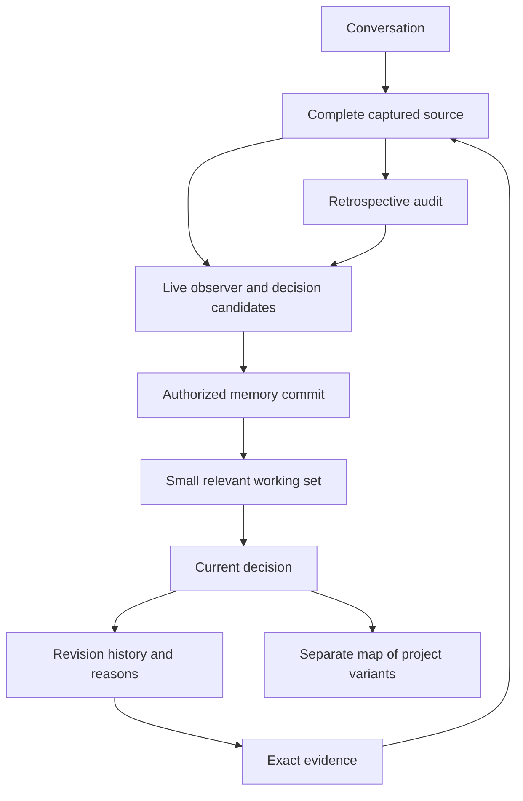

# Aniukas Lossless Memory

**A small working memory. A complete captured archive. A traceable history of every decision.**

**Original concept and system architecture: Andrius Cincys.**

Aniukas Lossless Memory (ALM) is a build specification for memory that survives long conversations, changing projects, and replacement AI models. It keeps original conversations, extracts decisions with exact evidence, and lets an assistant move from today's answer to its reasoning and full history whenever needed.

**Release: 0.2.0-alpha.3 — specification and executable contract kit.** The checkers and synthetic examples run today. The memory service, live observer, search engine, and integrations are requirements to build; this package does not claim they already exist. It prescribes no programming language, database, model, operating system or hardware, so any system — including a homemade one — can implement it through its own adapters.

## In ordinary language

Think of an assistant with a small desk and a large filing cabinet. The desk holds what matters today. The cabinet keeps the original conversations. Every useful desk note points to why it exists, how it changed, and exactly what was said.

An everyday task uses the desk notes. A difficult decision opens the explanation, then the original evidence if necessary. The assistant can examine several related decisions together without loading its entire lifetime into one conversation.

Each project owns its notebook. It may create a local exception and propose a better shared rule. A global rule manager may suggest a project change. Neither can silently rewrite the other's notebook. The human owner retains authority over both.

Decisions are detected while conversation happens, including informal decisions. Tentative ideas remain candidates; a later audit catches meaning missed earlier. An extraction mistake can be investigated because the captured source survives.

“Lossless” describes preservation of **captured evidence**. It does not promise perfect extraction, perfect retrieval, capture of information a host never supplied, or unlimited physical storage. See the [limits and acceptance criteria](docs/ACCEPTANCE.md).

## Start here

| Reader | Read |
|---|---|
| See how the system works | Start with the [fictional walkthrough](examples/WALKTHROUGH.md), then [the plain-language explanation](docs/EXPLAINED.md) |
| Build an implementation | [Build specification](BUILD_SPEC.md), [data contracts](docs/DATA_CONTRACTS.md), and [implementation plan](docs/IMPLEMENTATION_PLAN.md) |
| Track what you have built | [Requirements](docs/REQUIREMENTS.md) and the [machine-readable checklist](docs/requirements.json) |
| Adapt to your agents and hardware | [Adaptation guide](docs/ADAPTATION.md) and [implementation choices](docs/OPEN_CHOICES.md) |
| Test compatibility | [Reference format](docs/REFERENCE_FORMAT.md), [schemas](schemas/), and [portable conformance cases](conformance/README.md) |
| Try code in other languages | [JavaScript and C# source/evidence examples](examples/REFERENCE_IMPLEMENTATIONS.md) |
| Fork, modify, or contribute | [CONTRIBUTING.md](CONTRIBUTING.md), [LICENSE](LICENSE), and [attribution](ATTRIBUTION.md) |



## Run the contract checks

Checker tools require **Python 3.11 or later**. The CI configuration uses Python 3.12 on Windows, Linux, and macOS. A future memory implementation may use any language that satisfies the contracts.

Create a virtual environment from the repository root:

```text
python -m venv .venv
```

On Windows PowerShell:

```powershell
.venv\Scripts\python.exe -m pip install -r requirements-dev.txt
.venv\Scripts\python.exe tools/check_all.py
```

On Linux or macOS:

```sh
.venv/bin/python -m pip install -r requirements-dev.txt
.venv/bin/python tools/check_all.py
```

These commands check requirement coverage, schemas, generated examples, semantic integrity, documentation links, and regression tests. They do not start a memory server or benchmark an unimplemented system.

The examples contain synthetic conversations. Your real logs, credentials, models, and operational databases belong outside this public repository.

## What an implementation must preserve

- Complete captured originals and exact, stable evidence references.
- Current state, immutable revision history, rejected ideas, unresolved conflicts, authority, and temporal validity.
- A bounded combined working set with explicit overflow and on-demand deeper retrieval.
- Reciprocal project/global ownership enforced outside the model's instructions.
- Local rule variants with pinned ancestry, separate derivative maps, and owner-controlled adoption.
- Live decision extraction, candidate review, retrospective auditing, replay, backup, and portable restore.

Optional embeddings, accelerators, server databases, and a graphical explorer can improve a deployment. They must preserve the same evidence and ownership guarantees. A reduced capture/manual profile remains useful when no suitable extraction model is available; it must identify its missing automatic capabilities.

## Free reuse and credit

The **whole package is MIT licensed**, including its specification, documentation, schemas, examples, and tools. Keep the supplied copyright and permission notice when redistributing covered material. Forks, modifications, adaptations, and contributions are welcome. Changes to the maintained original are reviewed through pull requests; a public fork does not change it. See [LICENSE](LICENSE) and [CONTRIBUTING.md](CONTRIBUTING.md).

Suggested credit: **“Based on Aniukas Lossless Memory, originally conceived and designed by Andrius Cincys.”** [Attribution guidance](ATTRIBUTION.md).
